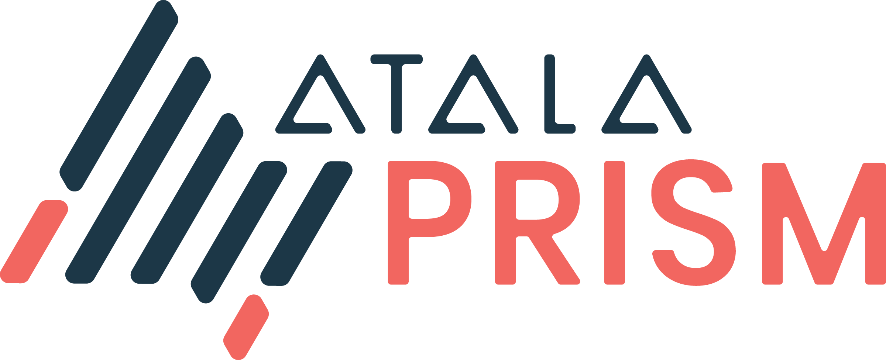

# Mercury

Mercury building block - DIDComm V2 &amp; Peer:DID
Kotlin Multiplatform with support for the following targets:

- JS
- iOS
- Android
- JVM

## Usage

Please have a look at unit tests, more samples will be added soon.

## License

This software is provided 'as-is', without any express or implied warranty. In no event will the
authors be held liable for any damages arising from the use of this software. Permission is granted
to anyone to use this software for any purpose, including commercial applications, and to alter it
and redistribute it freely.
